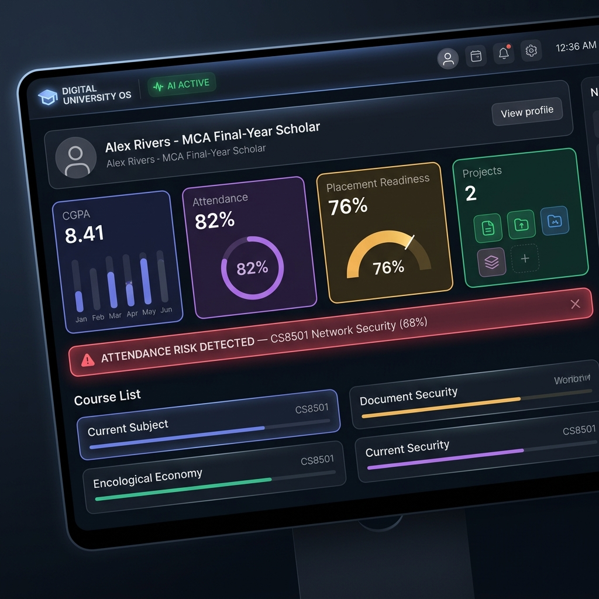
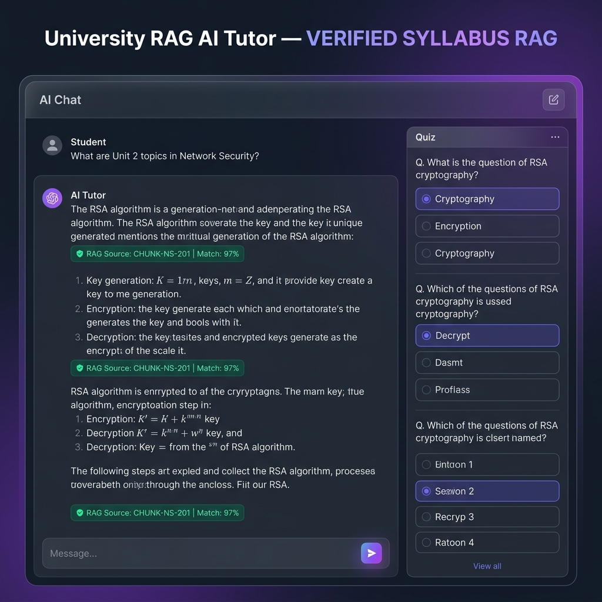
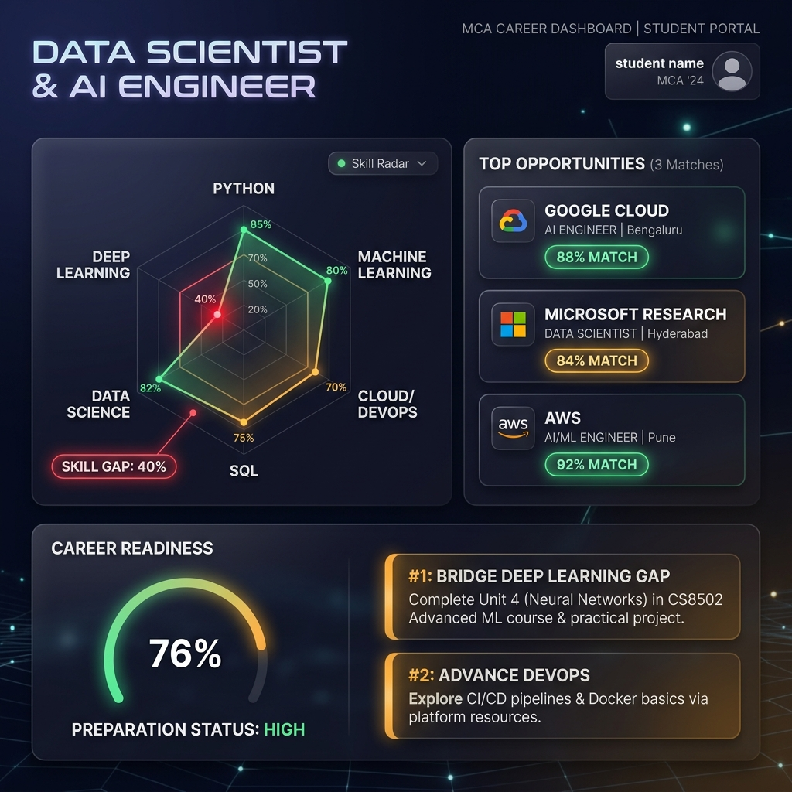

# Digital University OS — AI-Powered Integrated University Operating System

> **Digital University OS: An AI-Powered Integrated University Operating System for Academic, Research, Attendance, Projects and Career Management**

[](https://github.com/vijaymahes9080/Digital-University-OS)
[](LICENSE)
[](https://vitejs.dev/)
[](https://react.dev/)
[](https://tailwindcss.com/)

---

## 📸 System Previews

<div align="center">
  
  <br/>
  <br/>
  
  <br/>
  <br/>
  
</div>

---

## 🏛 Project Architecture & Common University Data Layer

Unlike legacy isolated college management tools or basic CRUD portals, **Digital University OS** interlinks all 8 major university domains through a **Common Data Layer** and a live **University Intelligence Graph**.

```text
                 DIGITAL UNIVERSITY OS
                         │
        ┌────────────────┼────────────────┐
        │                │                │
     STUDENTS          FACULTY          ADMIN
        │                │                │
        └────────────────┼────────────────┘
                         │
              ┌──────────┴──────────┐
              │                     │
        UNIVERSITY DATA        AI INTELLIGENCE
              │                     │
    ┌─────────┼─────────┐           │
    │         │         │           │
Attendance Projects Research     AI Tutor
    │         │         │           │
    └─────────┼─────────┘           │
              │                     │
         Placement ───────────── Analytics
```

When a student's attendance changes or a capstone milestone is approved, the data flows reactively across:
`Student Dashboard` ➔ `Faculty Reviewer` ➔ `Placement Skill Gap Engine` ➔ `RAG AI Tutor` ➔ `University Intelligence Analytics`.

---

## 🚀 Key Modules & Flagship Features

| Module | Features & Innovation |
| :--- | :--- |
| 🔐 **Identity & Access** | Multi-role view switcher (**Student**, **Faculty**, **Admin**), biometric MFA login simulation, and JWT session handling. |
| 🎓 **Student Module** | CGPA tracking (8.41), overall attendance gauge (82%), placement readiness (76%), course roster, and high attendance risk alerts. |
| 👨‍🏫 **Faculty Module** | Attendance risk monitor (<75%), 1-click attendance logger, Bloom's Taxonomy AI MCQ generator from course materials, and capstone milestone reviewer. |
| 🤖 **AI Tutor + Vector RAG** | Vector similarity search across course syllabi (CS8501, CS8502, MCA801) and academic regulations. Includes RAG Citation Inspector, interactive quiz testing, and **Web Speech API Voice Assistant**. |
| 📊 **Attendance Intelligence** | Predictive risk calculator under University Regulation 4.2, Monte Carlo time-series simulator for future session outcomes, and medical condonation request workflow. |
| 🚀 **Projects Management** | Capstone lifecycle (Proposal, Guide Assignment, Milestones, GitHub integration, Faculty Approvals, IEEE LaTeX Manuscript Generator). |
| 🔬 **Research Management** | IEEE/Springer paper publication tracker, Indian Patent Office (IPO) filings, and benchmark dataset download hub. |
| 💼 **Placement Engine** | Skill gap radar analysis, live corporate job matching (Google Cloud AI, Microsoft Research, AWS), AI Mock Interview technical recruiter, and automated skill status upgrades. |
| 📈 **Analytics & Graph** | **University Intelligence Graph** interactive node network visualizer, campus attendance heatmaps, and department benchmarks. |
| 🔗 **Blockchain Credentials** | Decentralized cryptographic SHA-256 degree proof hash generator and public employer verification portal. |
| ⌨ **Command Palette** | Keyboard shortcut (`Ctrl+K` / `Cmd+K`) instant command launcher and global university search modal. |

---

## 🎯 Guided MCA Evaluator Demo Flow

The application includes a top **Guided MCA Demo Bar** allowing evaluators to step through a complete student lifecycle:

1. **Step 1 — Student Dashboard**: Observe **HIGH ATTENDANCE RISK** warning on CS8501 (68%).
2. **Step 2 — Faculty Log Attendance**: Switch to Faculty (*Dr. Sarah Vance*) and log 2 classes Present for CS8501. Attendance updates to 76.0% (*SAFE status*).
3. **Step 3 — RAG AI Tutor Search**: Ask *"What are the Unit 2 topics in CS8501 Network Security?"*. RAG retrieves syllabus document `CS8501 Unit 2: RSA Cryptography` with chunk citations and interactive quiz testing.
4. **Step 4 — Capstone Milestone Approval**: Switch to Faculty and review Milestone 3 (*Placement Skill Integration*). Assign score 96 with faculty feedback.
5. **Step 5 — Placement Skill Sync**: Switch to Placement and observe **Deep Learning** skill status upgrade to MET and placement readiness increase to 84%.
6. **Step 6 — Intelligence Graph**: Open the **University Intelligence Graph** modal to see all connected nodes in action.

---

## 🛠 Tech Stack

- **Frontend Framework**: React 18.3 + Vite 6.0
- **Styling & Aesthetics**: Tailwind CSS 3.4 + Glassmorphism + Dark Mode
- **Icons**: Lucide React
- **Charts & Visualizations**: Recharts
- **Celebration Effects**: Canvas Confetti
- **Audio & Speech**: Native Web Speech API (SpeechRecognition & SpeechSynthesis)
- **State Management**: React Context + LocalStorage Persistence

---

## ⚙ Installation & Local Development

### 1. Clone the repository
```bash
git clone https://github.com/vijaymahes9080/Digital-University-OS.git
cd Digital-University-OS
```

### 2. Install dependencies
```bash
npm install
```

### 3. Start development server
```bash
npm run dev
```

### 4. Build for production
```bash
npm run build
```

---

## 📄 License

This project is licensed under the [MIT License](LICENSE).
